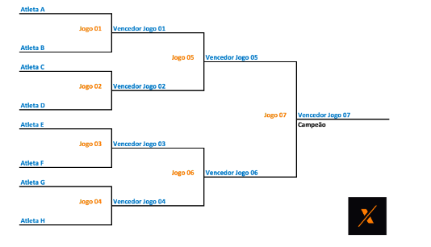

<h1 align="center">Sistema de eliminatorias</h1>

  <a href="#-tecnologias">Tecnologias</a>&nbsp;&nbsp;&nbsp;|&nbsp;&nbsp;&nbsp;
  <a href="#-projeto">Projeto</a>&nbsp;&nbsp;&nbsp;|&nbsp;&nbsp;&nbsp;
  <a href="#-requisitos">Requisitos</a>&nbsp;&nbsp;&nbsp;|&nbsp;&nbsp;&nbsp;  
  <a href="#-como-executar">Como executar</a>&nbsp;&nbsp;&nbsp;|&nbsp;&nbsp;&nbsp;  

 

## ✨ Tecnologias

Esse projeto foi desenvolvido com as seguintes tecnologias:

- [Node](https://nodejs.org/en/)
- [TypeScript](https://www.typescriptlang.org/)
- [Prisma](https://www.prisma.io/)
- [Postgresql](https://www.postgresql.org/)
- [Docker](https://www.docker.com/)
- [Jest](https://jestjs.io/pt-BR/)

## 💻 Projeto

O objetivo é podermos cadastrar times neste sistema de chaves (como o de um campeonato, na imagem abaixo), independente da quantidade de times, desde que sejam respeitadas algumas regras.

 

## ⚡ Requisitos

- [x] Cadastrar campeonato (nome, descrição e premiação)
- [x] Listar um único campeonato
- [x] Listar todos os campeonatos cadastrados
- [x] Editar dados de um campeonato
- [x] Cadastrar times em um campeonato
- [x] Editar dados de um time
- [x] Listar todos os times criados
- [x] Listar um time específico
- [x] Listar times de um campeonato específico
- [x] Excluir um time (excluir também do campeonato não iniciado)
- [x] Um campeonato só poderá iniciar se existir uma quantidade de 2^n times no mesmo, onde n é a quantidade de chaves
- [x] Listar vencedor de cada partida, campeão e premiação

## 🚀 Como executar

- Clone o repositório
- Instale as dependências com `npm install ou yarn`
- Inicie o container do Postgresql com `docker-compose up`
- Inicie o servidor com `npm run dev ou yarn dev`

Agora o app estará rodando na sua máquina local em modo de desenvolvimento.

---

Feito com ♥ por [Júlio Souza](https://www.linkedin.com/in/j%C3%BAlio-souza-079351213/) 👋🏻
